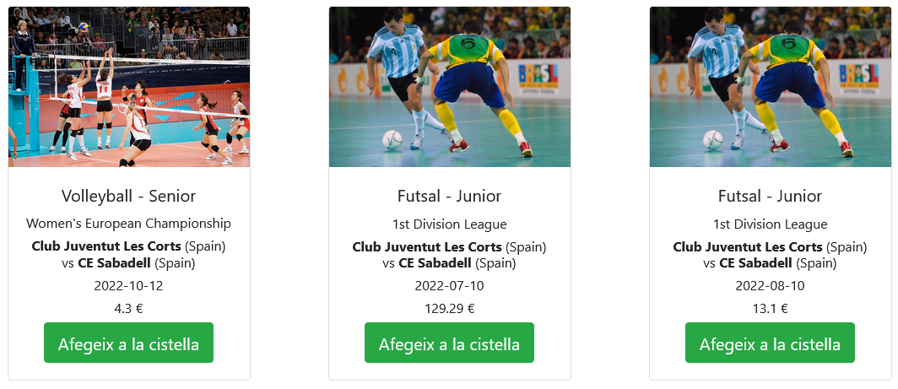
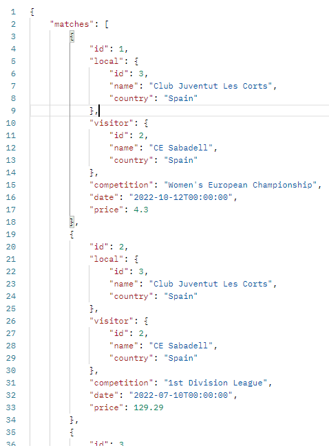
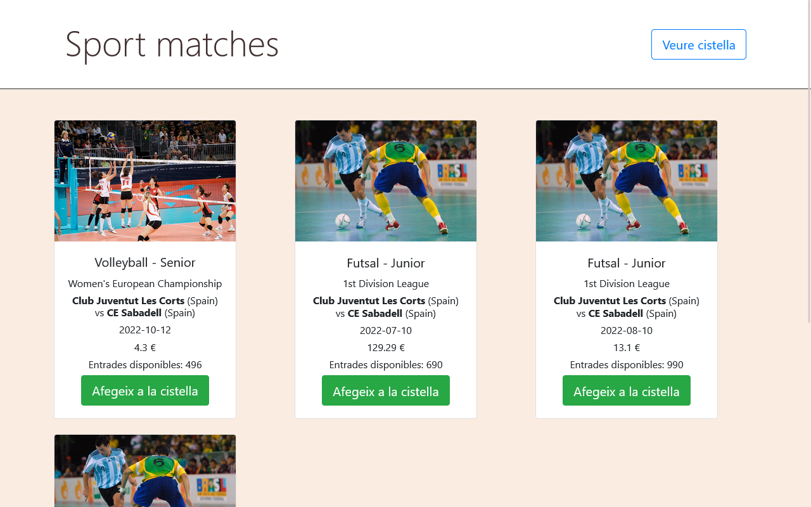
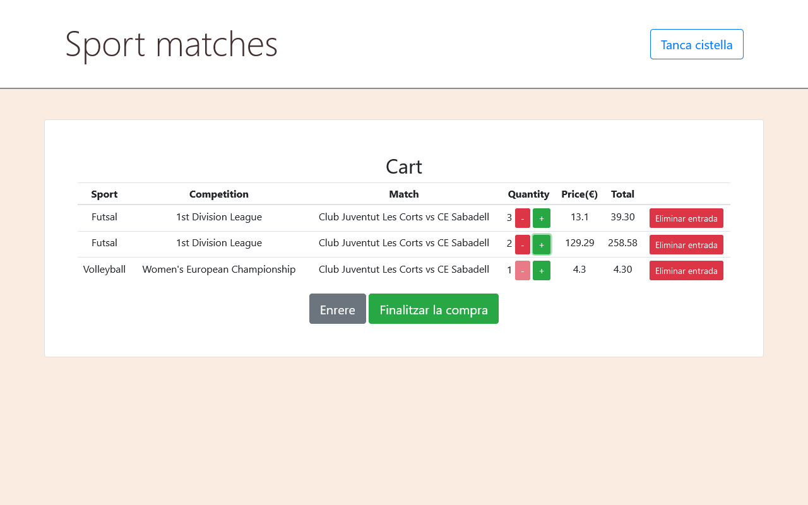
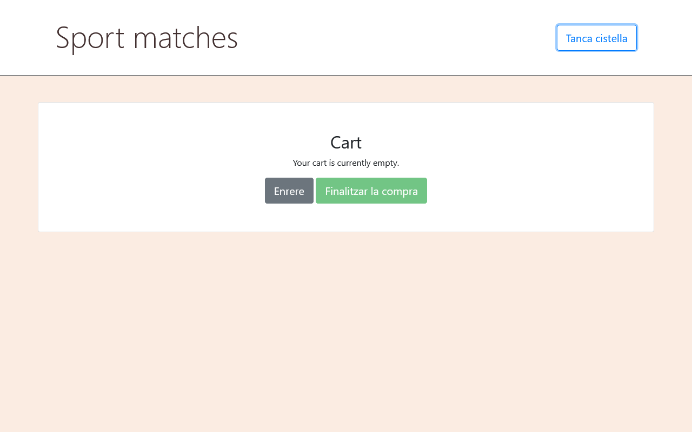

Sessió 4
=========
Bucles
------
Vue permet utilitzar bucles i és molt útil per a llistes. Imagineu-vos que tenim una llista de partits i volem mostrar la informació de cada partit per separat. Per fer-ho, creeu una llista de partits afegint una propietat a l'estructura retornada a `data ()` del component Matches.vue:

```javascript
matches: [
  {
    'id': 1,
    'local': {
      'id': 3,
      'name': 'Club Juventut Les Corts',
      'country': 'Spain'
    },
    'visitor': {
      'id': 2,
      'name': 'CE Sabadell',
      'country': 'Spain'
    },
    'competition': {
      'name': 'Women\'s European Championship',
      'category': 'Senior',
      'sport': 'Volleyball'
    },
    'date': '2022-10-12T00:00:00',
    'price': 4.3
  },
  {
    'id': 2,
    'local': {
      'id': 3,
      'name': 'Club Juventut Les Corts',
      'country': 'Spain'
    },
    'visitor': {
      'id': 2,
      'name': 'CE Sabadell',
      'country': 'Spain'
    },
    'competition': {
      'name': '1st Division League',
      'category': 'Junior',
      'sport': 'Futsal'
    },
    'date': '2022-07-10T00:00:00',
    'price': 129.29
  },
  {
    'id': 3,
    'local': {
      'id': 1,
      'name': 'CV Vall D\'Hebron',
      'country': 'Spain'
    },
    'visitor': {
      'id': 4,
      'name': 'Volei Rubi',
      'country': 'Spain'
    },
    'competition': {
      'name': '1st Division League',
      'category': 'Junior',
      'sport': 'Futsal'
    },
    'date': '2022-08-10T00:00:00',
    'price': 111.1
  }
]
```

Creeu un bucle `v-for` al template per visualitzar cada esdeveniment per separat:

```html
<div class="container">
  <div class="row">
    <div class="col-lg-4 col-md-6 mb-4" v-for="(match) in matches" :key="match.id">
      <br>
      <h5>{{ match.competition.sport }} - {{ match.competition.category }}</h5>
      <h6>{{ match.competition.name }}</h6>
      <h6><strong>{{ match.local.name }}</strong> ({{ match.local.country }}) vs <strong>{{ match.visitor.name }}</strong> ({{ match.visitor.country }})</h6>
      <h6>{{ match.date.substring(0,10) }}</h6>
      <h6>{{ match.price }} &euro;</h6>
    </div>
  </div>
</div>
```

### Exercici 1:

Modifiqueu el codi actual per mostrar els partits de manera estructurada. Una forma podria ser utilitzar targetes (<https://getbootstrap.com/docs/4.0/components/card/>). A més, implementeu el botó "Afegeix a la cistella" i afegiu una imatge d'un partit que us agradi a cada targeta. Aquest botó també ha d'afegir l'esdeveniment comprat amb la seva informació en una llista de `matches_added:[]` definida a `data()` i  tenint en compte que per afegir un nou show feu servir aquesta instrucció `this.matches_added.push(match)`. Associeu una funció `addEventToCart` que faci això quan es cliqui al botó. No us preocupeu pel nombre d’entrades disponibles. Més endavant, gestionarem el nombre de tiquets disponibles on haurem de disminuir el nombre de tiquets comprats.



Obtenir dades d'APIs amb AXIOS
---------

Per a poder obtenir dades amb la mateixa estructura que el diccionari anterior, necessitem afegir certa informació a l'output de l'endpoint matches. Ajusteu el schema de l'endpoint matches perquè retorni la informació de la competició. 


En lloc de declarar una llista de partits, fem servir la nostra API desenvolupada a FastAPI per GET, POST, PUT i DELETE mitjançant Vue. Per consumir rutes des de Vue, fem servir la biblioteca axios:

	npm install axios -saves
	
Importeu axios a l'script just després de `<script>`:

```html
<script>
import axios from 'axios'

export default {
```

Executeu l'aplicació FastAPI i afegiu el codi següent als mètodes de vue:

```javascript
getMatches () {
      const pathMatches = 'http://localhost:8000/matches/'
      const pathCompetition = 'http://localhost:8000/competition/'

      axios.get(pathMatches)
        .then((res) => {
          var matches = res.data.matches.filter((match) => {
            return match.competition_id != null
          })
          var promises = []
          for (let i = 0; i < matches.length; i++) {
            const promise = axios.get(pathCompetition + matches[i].competition_id)
              .then((resCompetition) => {
                delete matches[i].competition_id
                matches[i].competition = {
                  'name': resCompetition.data.competition.name,
                  'category': resCompetition.data.competition.category,
                  'sport': resCompetition.data.competition.sport
                }
              })
              .catch((error) => {
                console.error(error)
              })
            promises.push(promise)
          }
          Promise.all(promises).then((_) => {
            this.matches = matches
          })
        })
        .catch((error) => {
          console.error(error)
        })
    }
```

On `/matches` tornarà la llista de tots els partits que ja heu registrat. Per exemple:



I per una altra banda, estem utilitzant els endpoints `/competition/<id>` per a recuperar la informació de les competicions i inserir-la al diccionari.

A més, afegiu created() sota i fora dels mètodes. Permet que el codi s’executi cada vegada que s’inicialitza la web.

```javascript
created () {
    this.getMatches()
  }
```

D’aquesta manera, podeu obtenir les dades de la vostra API.

### Exercici 2:

Canvieu la llista de partits creada a l'apartat anterior per una llista buida, i comproveu que el codi per aconseguir els partits de la nostra API funciona correctament.

Vista de la cistella
--------



En aquesta vista, veurem totes les comandes de l'usuari. A més, l'usuari podrà finalitzar la compra. Aquesta vista es pot definir com a part de Matches.vue, però no en un component nou, només en un condicional per mostrar la part de partits o la part de la cistella. 

Canvis en el Backend per a la cistella:
---------

Abans de continuar amb la nostra visualització de partits, implementem un model de compte d'usuari per identificar un usuari i guardar les seves comandes comprades. En primer lloc, com heu fet anteriorment amb Match o Competition, creeu un model nou anomenat Account a models.py. En aquest cas, utilitzarem una relació d'un a molts. La taula "Accounts" té les columnes següents:

```python
class Account(Base):
    __tablename__ = 'accounts'

    username = Column(String(30), primary_key=True, unique=True, nullable=False)
    password = Column(String(), nullable=False)
    # 0 not admin/ 1 is admin
    is_admin = Column(Integer, nullable=False)
    available_money = Column(Float, nullable=False)
    orders = relationship('Order', backref='orders', lazy=True) 

    def __init__(self, username, available_money=200, is_admin=0):
        self.username = username
        self.available_money = available_money
        self.is_admin = is_admin

```

No inicialitzarem Account amb una contrasenya. Veurem a les properes sessions per què, però per al proper exercici només heu de tenir una contrasenya falsa: inicialitzeu el camp de la contrasenya a la funció init del Account fent "self.password = 'test'".


Un cop creat Account, creem un model i un recurs nous per desar tots els partits comprats. L'anomenarem Order. Camps de la taula de comandes:

```python
class Order(Base):
    __tablename__ = 'orders' 

    id = Column(Integer, primary_key=True)
    username = Column(String(30), ForeignKey('accounts.username'), nullable=False)
    match_id = Column(Integer, nullable=False)
    tickets_bought = Column(Integer, nullable=False)
    
    def __init__(self, match_id, tickets_bought):
        self.match_id = match_id
        self.tickets_bought = tickets_bought

```

Finalment, afegiu un camp nou `total_available_tickets` al model de Match que per defecte sigui el nombre de localitats del lloc on s'està fent i feu les actualitzacions necessàries al constructor.
	`total_available_tickets = Column(Integer)`

### Exercici 3:

Creeu aquests punts finals (endpoints) a `main.py`, així com els schemas corresponents a `schemas.py`:

- POST: crea un nou compte d'usuari.
- GET: retorna totes les comandes per nom d'usuari.
- POST: afegeix una nova comanda per nom d'usuari.
- GET: retorna totes les comandes.

```python
@app.post('/account', response_model=schemas.Account)
@app.get('/orders/{username}', response_model=schemas.Order)
@app.post('/orders/{username}', response_model=schemas.Order)
@app.get('/orders', response_model=list[schemas.Order])')
```

A `repository` feu els següents passos per a la lògica de negoci d'afegir una nova comanda:

       1. Comproveu si l'usuari té prou diners per comprar el bitllet

       2. Comproveu si hi ha entrades disponibles

       3. Actualitzeu les entrades disponibles a Match (- entrades comprades)

       4. Actualitzeu els diners de l'usuari després de comprar els bitllets (-preu * bitllets comprat)

       5. Afegiu la comanda a la relació d'usuari `user.orders.append(new_order)`

       6. Deseu els canvis fets a  comanda, match i l'usuari a la BD. **Atenció!** amb les condicions de carrera!. Feu un sol commit per a totes les operacions i comproveu si es provoca algun error, en aquest cas caldrà fer un rollback i tornar-ho a intentar o retornar un error.


Vista taula de la cistella
----------



Ara ja podem tornar a editar el nostre frontend. Fem la taula on l'usuari pot visualitzar la seva comanda i la seva informació. En aquesta taula, podem veure:

1. **Esport**

1. **Competició**

1. **Partit** (Club Juventut Les Corts vs CE Sabadell)

1. **Quantitat**: quantitat d'entrades comprades per a aquest espectacle. L'usuari pot interactuar afegint o restant un bitllet amb dos botons.

1. **Preu**: preu per bitllet

1. **Total**: suma del preu de totes les entrades

1. **Eliminar entrada**: botó per esborrar un partit de la cistella

Per crear aquesta taula, podeu utilitzar l'estructura clàssica
(<https://www.w3schools.com/html/html_tables.asp>). `<thead>` conté les capçaleres:

```html
<table>
  <thead>
  <tr>
    <th>Sport</th>
    <th>Competition</th>
    <th>Match</th>
    <th>Quantity</th>
    <th>Price(&euro;)</th>
    <th></th>
  </tr>
  </thead>
  <tbody>
    ...
  </tbody>
</table>
```

`<tbody>` en el nostre cas, conté la informació i els botons a
interactuar (augmentar, disminuir)

### Exercici 5: 

1. Creeu una taula amb partits i la seva informació

2. Creeu els botons per augmentar i disminuir el nombre d'entrades pels partits en la cistella i els seus mètodes associats quan es faci click.

Botó de tornar enrere
-----------

Creem un botó per tornar a la vista principal:

1. Creeu una variable anomenada, per exemple, `is_showing_cart`. Serà el nostre condicional per mostrar la vista de Partits o de Cistella.

3. Enllaceu la variable creada anteriorment amb un botó nou "Veure cistella" per mostrar la cistella que faci (is_showing_cart = true)

4. Enllaça la variable creada anteriorment amb un nou botó "Enrere" que faci (is_showing_cart = false)

per alternar d'una vista a l'altra, feu servir el v-if   en el `<div>` on es mostri la cistella:
```html
	<div v-if="is_showing_cart" class="container"> 
		<h1> Cart </h1>
		...
	</div>
	<div v-else class="container">
		...
	</div>	
```

Podeu fer servir v-if en qualsevol tag per que es mostri en cas de ser cert o ocultar-lo en cas de ser fals, per exemple podeu fer que s'activi la taula només si hi ha elements en la taula així:
```html
  <table v-if="matches_added.length > 0" class="table">
    ...
  </table>
  <p v-else>Your cart is currently empty.</p>
 ```

Qualsevol v-else que poseu buscarà l'últim v-if que hi hagi, i el bloc definit per la condició serà des de l'v-if fins al v-else.

Finalitza el botó de compra
-----

Aquest botó executa un mètode POST que desa totes les files de comanda de la base de dades:

```javascript
addPurchase (parameters) {
  const path = 'http://localhost:8000/order/test'
  axios.post(path, parameters)
    .then(() => {
      console.log('Order done')
    })
    .catch((error) => {
      // eslint-disable-next-line
      console.log(error)
      this.getMatches()
    })
},
```
amb els paràmetres:

```javascript
const parameters = {
  match_id: this.matches_added[i].match.id,
  tickets_bought: this.matches_added[i].quantity
}
```
A continuació, hauríem de restablir la llista on emmagatzemem
els partits per comprar i desactivar el botó finalitzar la compra. L'usuari hauria de veure:



Ara tenim la informació per actualitzar els diners disponibles de l’usuari després de comprar la comanda.

### Exercici 7:

1. Creeu un botó anomenat Finalitzar la compra
2. Creeu un mètode POST per enviar la compra  (POST per fila)

    ```javascript
    finalizePurchase () {
      for (let i = 0; i < this.matches_added.length; i += 1) {
        const parameters = {
          match_id: this.matches_added[i].match.id,
          tickets_bought: this.matches_added[i].quantity
        }
        this.addPurchase(parameters)
      }
    }
    ```
Podeu fer una crida a l'endpoint del post de les comandes per cada partit per separat. En aquest cas haureu d'esperar el resultat de la crida per fer la següent, ja que l'usuari es pot haver quedat sense diners, o no quedi prou entrades per comprar. En aquest cas 
es tracta la cistella com si fossin comandes independents.

Per tal d'enviar-les totes de cop i que sigui el backend que comprovi si es poden fer totes les compres o no, podeu fer que l'endpoint del post de les comandes accepti una llista de comandes i fer una única crida al backend. En aquest cas 
la cistella es tracta com una única comanda, en el sentit que o es compren totes les entrades o no es compra cap.

3. Inicialitzar la cistella i desactivar el botó


	